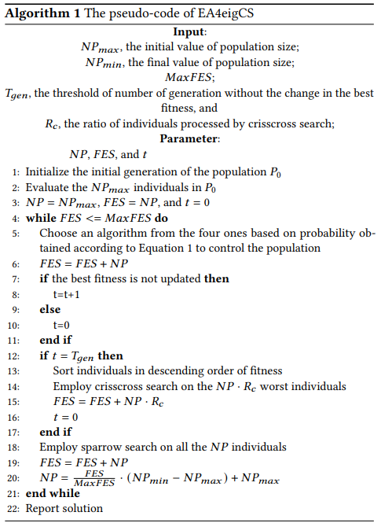

# An Ensemble of Evolutionary Algorithms With Both Crisscross Search and Sparrow Search




In the field of artificial intelligence, real parameter single objective optimization is an important direction. In recent years, researchers begin to study long-term search. Both the Differential Evolution (DE) and the Covariance Matrix Adaptation Evolution Strategy (CMA-ES) demonstrate good performance for real parameter single objective optimization.  Nevertheless, new types of evolutionary algorithm are still proposed for the purpose. In this paper, we introduce two new types of evolutionary algorithm - crisscross search and sparrow search - into the ensemble of three DE variants and CMA-ES suitable for long-term search - EA4eig - because both of the two methods are conducive to avoid local convergence.
Thus, EA4eigCS is obtained. Experimental results show that our EA4eigCS outperforms EA4eig and is competitive when compared with state-of-the-art algorithms.

### Running

###environment
```
MATLAB version >= 2019
```
### Scripts
#### Running on CEC2020
```
code\2020 EA4eigCS\main_2020_flag_fitworse.m
```
#### Running on CEC2022
```
code\2022 EA4eigCS\main_2022_flag_fitworse.m
```
### Benchmark

We use CEC2022 benchmarks in this paper, including:

* [Single Objective Bound Constrained Benchmark 2022](https://github.com/P-N-Suganthan/2022-SO-BO) 

We also use CEC2020 benchmarks, including:

* [Single Objective Bound Constrained Benchmark 2020](https://github.com/P-N-Suganthan/2020-Bound-Constrained-Opt-Benchmark)


## Acknowledgements

We gratefully acknowledge the help of Prof. Ponnuthurai Nagaratnam Suganthan, who provided the benchmarking of CEC.
